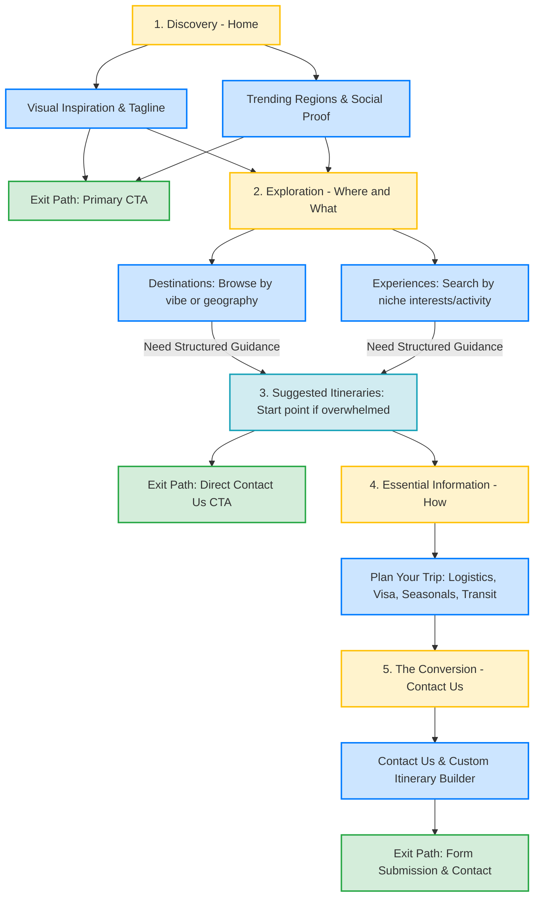

# Taprobane Way - Discover Sri Lanka

Taprobane Way is a premium, content-driven travel exploration website and interactive trip builder designed to showcase the raw natural beauty, rich cultural heritage, and serene adventure of Sri Lanka (historically known as Taprobane). 

---

## 1. Project Purpose

The primary objective of **Taprobane Way** is to bridge the gap between curious global travelers and local Sri Lankan tourism. The website serves two primary purposes:

1. **Travel Discovery & Inspiration**: Provides a highly visual, immersive browsing experience that explains the essence of Sri Lanka—its golden coastlines, misty tea countries, ancient cultural monuments, and exotic wildlife.
2. **Pre-Made & Tailored Trip Facilitation**: Showcases pre-made travel packages designed by Sri Lankan travel agencies, while providing a self-service interactive trip planning tool that generates custom itineraries and connects travelers directly with agencies for booking.

---

## 2. Information Architecture & User Flow

The website structure and user journeys are modeled directly on the pre-design flowchart to guide users from initial discovery to successful booking conversion.

### Pre-Design User Flow (Figma)

---

### User Flow Steps & Stages Explained

The user flow consists of a structured funnel with key interaction nodes:

#### I. Discovery (Home Page)
* **Initial Exposure**: Users land on the Homepage (`index.html`) where they are greeted by high-fidelity video backgrounds showcasing Sri Lankan landscapes and a compelling tagline ("Discover the Pearl of the Indian Ocean").
* **Social Proof & Validation**: Users view trending regions, signature items, and reviews to build trust.
* **Exit Option**: An immediate **Primary CTA** ("Book Now" or "Explore") provides a direct path to convert for returning or high-intent travelers.

#### II. Exploration (Where and What)
* **Destinations (`where-to-go.html`)**: Focuses on spatial categorization. Users browse by vibe (beaches, hill country) or geographical region to understand the layout of Sri Lanka.
* **Experiences (`what-to-do.html`)**: Focuses on activity categorization. Users search and filter by niche interests (Ayurvedic wellness, wildlife safari, coastal surfing).

#### III. Suggested Itineraries (`explore-trips.html`)
* **Overwhelm Mitigation**: Serves as a critical intermediate decision point. If users feel overwhelmed by options, this section gives them highly curated pre-made starting points (e.g., *The Heritage Loop*).
* **Exit Option**: All pre-made itinerary details end with a direct CTA pointed to the contact form for rapid booking confirmation.

#### IV. Essential Information (How-To Logistics)
* **Plan Your Trip Guide**: Before committing to a custom itinerary, users learn logistical requirements:
  * **Visas**: Entry requirements and official application portal links.
  * **Seasonality**: An interactive seasonal guide on when to visit (monsoon patterns).
  * **Transit**: Local transportation advice (tuktuks, private drivers, scenic trains).

#### V. The Conversion (Contact Us & Itinerary Builder)
* **Custom Itinerary Builder (`plan-trip.html`)**: Serves as the primary lead capture mechanism. Users interact with a multi-step constructor to define their travel parameters:
  * Travel style (Luxury, Balanced, Backpacker)
  * Duration & arrival dates
  * Number of travelers
  * Selection of interests & activities (safaris, tea trails, surfing)
* **Dynamic Route Mapping**: An interactive Leaflet map overlays the chosen route coordinates.
* **Form Submission**: Captures traveler emails, details, and message context, saving records locally (accessible on the Admin Dashboard for travel agency responses).

---

### Website Information Architecture (Page Map)

* **Home (`index.html`)**: Autocomplete search bar, ambient background video, social validation.
* **Where to Go (`where-to-go.html`)**: Dynamic filter tabs (Beaches, Hill Country, Cultural Triangle, Wildlife) linking to detailed articles (`mirissa-bay.html`, `ella.html`, `galle.html`, `kandy.html`).
* **What to Do (`what-to-do.html`)**: Signature experiences linking to detailed articles (`ayurvedic-wellness.html`, `surfing-arugam-bay.html`, `eco-tourism-sinharaja.html`).
* **Explore Trips (`explore-trips.html`)**: Signature collections with detail pages (`heritage-loop.html`).
* **Plan Trip (`plan-trip.html`)**: Interactive trip builder form with route map overlays.
* **Contact (`contact.html`)**: Inquiry lead form.
* **Admin Dashboard (`Dashboard/index.html`)**: Client-side storage console displaying user itinerary/contact data for agents.

---

## 3. Design System & Technology Stack

The project represents a design concept inspired by **Tropical Modernism**—clean lines, heavy use of natural hues, lush greens, soft warm grays, and spacious layouts.

### Style Guide & CSS Tokens

* **Primary Color Palette**:
  * Forest Green (`--primary-color: #104735`): Represents Sri Lanka's tea plantations and tropical flora.
  * Warm Dark Green (`--primary-hover: #0c3628`): Used for hover interactions on main components.
  * Warm Light Gray (`--bg-header: #F1F1F1`): Provides a clean, modern, neutral background contrast.
  * Charcoal Dark (`--text-main: #2D2D2D`): High contrast color for body text to ensure maximum accessibility and readability.
* **Typography**:
  * Google Fonts: **Plus Jakarta Sans** (`'Plus Jakarta Sans', system-ui, -apple-system, sans-serif`). A contemporary, clean geometric sans-serif that balances modern elegance with high legibility.
* **UI Components**:
  * High-radius rounded edges (`border-radius: 50px` for buttons, `16px` for cards) to convey softness and serenity.
  * Glassmorphism navigation styling and blurred overlays to elevate the visual polish.

---

### Technology Choices

We opted for a **Vanilla + Utility** approach rather than complex single-page app frameworks (like React, Angular, or Next.js). Here is why this stack is the optimal choice for this project:

| Technology | Purpose | Rationale |
| :--- | :--- | :--- |
| **HTML5 / CSS3 / ES6 Javascript** | Core Architecture | **No Build Lag & Maximum Speed**: High SEO discoverability, clean semantic hierarchy, zero dependencies, and instant rendering speeds without hydration lag. |
| **Bootstrap 5 (CSS Grid)** | Layout & Responsiveness | **Grid Reliability**: Speeds up layout structure using mobile-first grid configurations while maintaining full control over custom styling. |
| **AOS (Animate On Scroll)** | Scroll Animations | **Lightweight Polish**: Adds subtle fade and zoom transitions as the user scrolls, creating a smooth storytelling feel with negligible performance impact. |
| **Leaflet.js** | Route & Mapping Visuals | **Open-source & API-free**: Implements interactive map routes in the trip planner without the payload weight or commercial billing requirements of Google Maps. |
| **Local Storage API** | Submission Mock Database | **Serverless Data Handling**: Allows local state persistence of custom itineraries and messages without requiring backend hosting or database setup during development. |

### Micro-Animations & Dynamic Feedback

* **Lion Silhouette Loader**: A custom animated preloader featuring a growing gold fill within a lion silhouette (symbolizing the ancient Lion Rock/Sigiriya and national heritage) to maintain branding continuity.
* **Interactive Heading Tracking**: The primary headings (`h1`) use a distance-based hover physics engine. Characters disperse away from the user's cursor dynamically on desktops, creating an engaging micro-interaction.
* **Button Ripple Effect**: Any button hover triggers a localized CSS ripple expanding outwards from the mouse entry coordinates.
* **Custom Magnetic Cursor**: A customized double-element cursor (center dot + trailing outline lerped via `requestAnimationFrame`) follows the mouse position, expanding and changing style when hovering over links, buttons, and cards.

---

## 4. Usability Testing

To ensure the application delivers an outstanding user experience, usability testing was structured around four main pillars:

### I. Device & Viewport Responsiveness
* **Testing Methods**: Responsive viewport testing across standard breakpoints:
  * Mobile Portrait (375px - 425px)
  * Tablet Portrait & Landscape (768px - 1024px)
  * Desktop (1200px and above)
* **Key Verifications**:
  * Global navigation links collapse into the **Mobile Navigation Drawer** via hamburger menu toggle.
  * Grids fold from horizontal columns to single vertical streams on smaller screens.
  * Interactive components like the Leaflet.js route map remain touch-scrollable and scale to fit mobile widths.

### II. Task-Based Scenario Testing
Tests were conducted based on specific user goal journeys:
* **Scenario 1**: *Find details about Galle Fort.*
  * *Step*: User enters "Galle" in the home search bar.
  * *Success Criteria*: The suggestion dropdown shows "Galle Fort" and clicking immediately redirects to `galle.html`.
* **Scenario 2**: *Plan a custom trip.*
  * *Step*: User fills the Trip Planner form (dates, traveler counters, Balanced style, interests).
  * *Success Criteria*: Clicking interests plots route markers, the path updates instantly, and submitting saves the exact data object to the database.

### III. Data Verification (Mock Backend)
* **Testing Methods**: Admin dashboard submission validation.
  * Form inputs are validated (e.g., checking email format validity).
  * Submissions are inspected within Google Chrome Developer Tools (`Application` -> `Local Storage` -> `taprobane_records`).
  * The Admin Dashboard (`Dashboard/index.html`) is audited to ensure data matches the input fields, sorts by newest entry, filters correctly by "Itineraries" or "Messages", and triggers mail client opening upon clicking "Email Back".

### IV. Accessibility & Performance Audit
* **Testing Methods**: Chrome Lighthouse Audit & Keyboard Navigation.
  * Forms utilize proper `<label>` elements linked with matching `for`/`id` values.
  * Buttons and links contain descriptive text or `aria-label` tags for screen readers.
  * Interactive suggestions in the search bar support standard keyboard commands (ArrowUp, ArrowDown, Enter, Escape).
